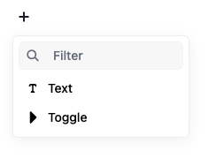
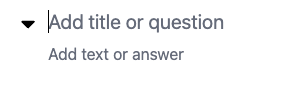

# Toggle Tool for Editor.js

Provides Toggle blocks for the [Editor.js](https://editorjs.io/).



## Features

- **Title Field**: Add a question or title for the toggle
- **Text Field**: Add the answer or content that expands/collapses
- **Expandable/Collapsible**: Click to expand or collapse content
- **HTML Support**: Both fields support rich text formatting
- **Line Breaks**: Supports line breaks within fields



## Installation

Use your package manager to install the package `editorjs-toggle`.

```bash
npm install editorjs-toggle

yarn add editorjs-toggle
```

## Usage Example

### Basic Setup

```javascript
import EditorJS from "@editorjs/editorjs"
import Toggle from "editorjs-toggle"

const editor = new EditorJS({
  tools: {
    toggle: Toggle,
  },
})
```

### With Custom Configuration

```javascript
const editor = new EditorJS({
  tools: {
    toggle: {
      class: Toggle,
      inlineToolbar: ["bold", "italic"],
      config: {
        titlePlaceholder: "Add title or question",
        textPlaceholder: "Add text or answer",
      },
    },
  },
})
```

### Output Data

```json
{
  "type": "toggle",
  "data": {
    "title": "What is Editor.js?",
    "text": "Editor.js is a block-styled editor with clean JSON output."
  }
}
```

## Development

This tool uses [Vite](https://vitejs.dev/) as builder.

**Commands**

`npm run dev` — run development environment with hot reload

`npm run build` — build the tool for production to the `dist` folder

## Configuration Options

| Option             | Type     | Default                   | Description                      |
| ------------------ | -------- | ------------------------- | -------------------------------- |
| `titlePlaceholder` | `string` | `'Add title or question'` | Placeholder text for title field |
| `textPlaceholder`  | `string` | `'Add text or answer'`    | Placeholder text for text field  |

## Links

[Editor.js](https://editorjs.io) • [Create Tool](https://github.com/editor-js/create-tool)
